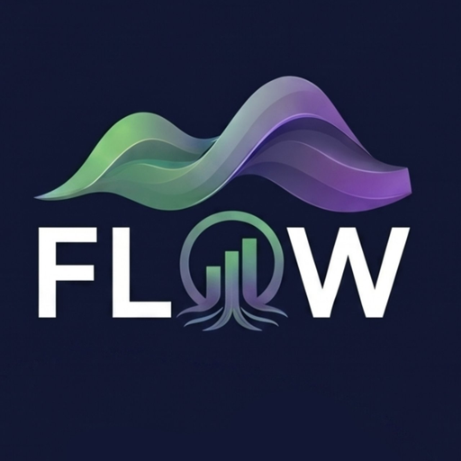

# FLOW — Budget Tracker

  

  <strong>Track your money. See where it goes. Hit your savings goals.</strong>

  <a href="https://younesthie.github.io/flow-budget/">Live App</a> · 
  <a href="#install">Install as PWA</a> · 
  <a href="#features">Features</a>

---

## What is FLOW?

FLOW is a personal budget tracker built as a Progressive Web App — no account, no backend, no subscription. Your data lives entirely on your device. It's designed around the way a student budget actually works: fixed recurring costs (rent, insurance, gym) that auto-apply every month, variable day-to-day spending you log manually, and a clear picture of what you can actually save.

The design follows Apple's Liquid Glass aesthetic — frosted glass cards, floating pill nav bar, and the full iOS color system.

---

## Features

**Overview**
- Net balance hero card with animated number transitions
- Income vs expenses with month-over-month deltas
- Smart insight chip that reads your actual financial state
- Spending breakdown by category with optional budget limits
- Savings goal progress bar
- Month projection card — from day 7, projects your end-of-month total based on fixed costs + daily spending rate
- Recent activity grouped by Today / Yesterday / This week

**Income**
- Recurring income templates (set once, auto-applies every month)
- One-time income entries for bonuses, gifts, freelance
- Segment control to switch between views

**Fixed Expenses**
- Recurring expense templates grouped by category with subtotals
- Per-month toggle to skip a fixed cost without deleting it

**Variable Expenses**
- Date-grouped transaction list
- Merchant name + optional notes field
- Daily average, days remaining, and vs-last-month stats

**Trends**
- 6-month bar chart (income / expenses / saved)
- Clean rounded Y-axis increments
- Tap any month to highlight it
- Monthly summary sheet — full recap with spending highlights and budget status

**Category Detail**
- Tap any category in the spending breakdown
- 6-month sparkline with trend direction
- All transactions for that category in the current month
- Budget tracking if a limit is set

**Onboarding**
- 5-step guided setup: currency → income → fixed costs → savings goal
- Reuses the same add/edit modals as the main app
- Data entered during onboarding flows straight into the app

**Settings**
- Currency symbol
- Monthly savings goal
- Export all data as CSV

---

## Install

FLOW is a PWA — it installs directly from the browser, no App Store needed.

**Android (Chrome)**
Visit the app → three-dot menu → *Add to Home screen* → Install.

**iPhone (Safari)**
Visit the app → Share button → *Add to Home Screen* → Add.

Once installed it runs fullscreen, works offline, and feels like a native app.

---

## Tech

- Vanilla JS + HTML/CSS — zero dependencies, zero build step
- `localStorage` for persistence — all data stays on your device
- Service worker for full offline support
- Single `index.html` — the entire app is one file

---

## License

MIT — do whatever you want with it.
